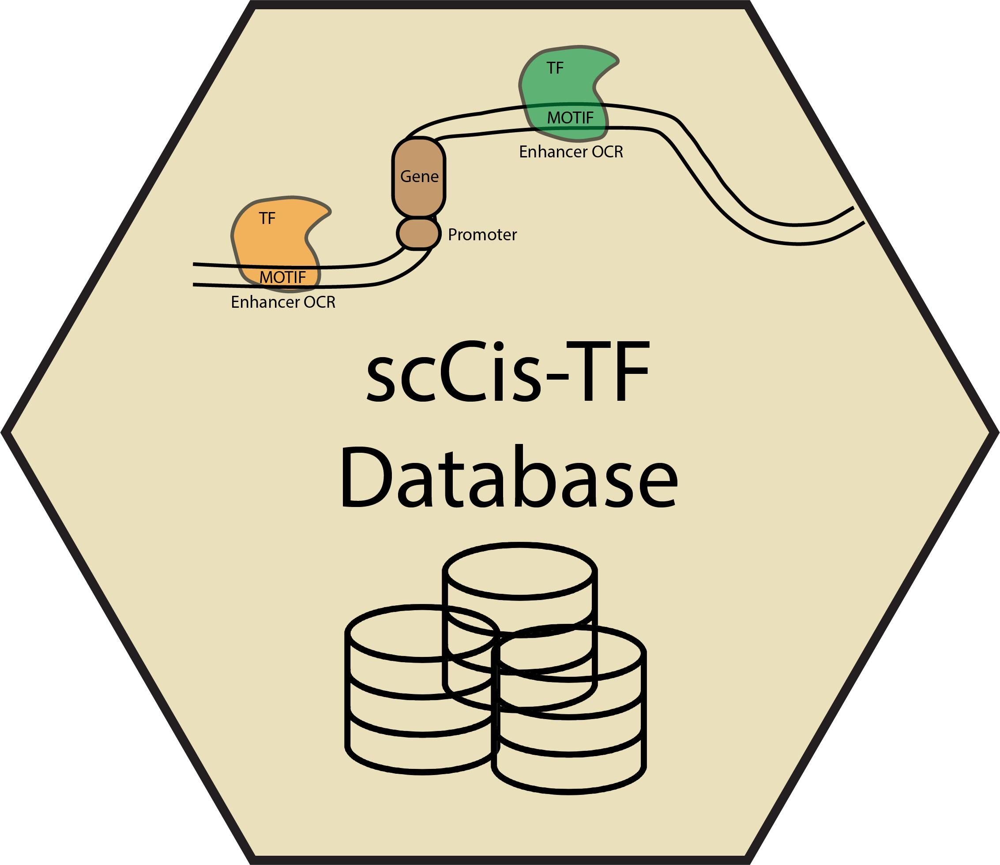
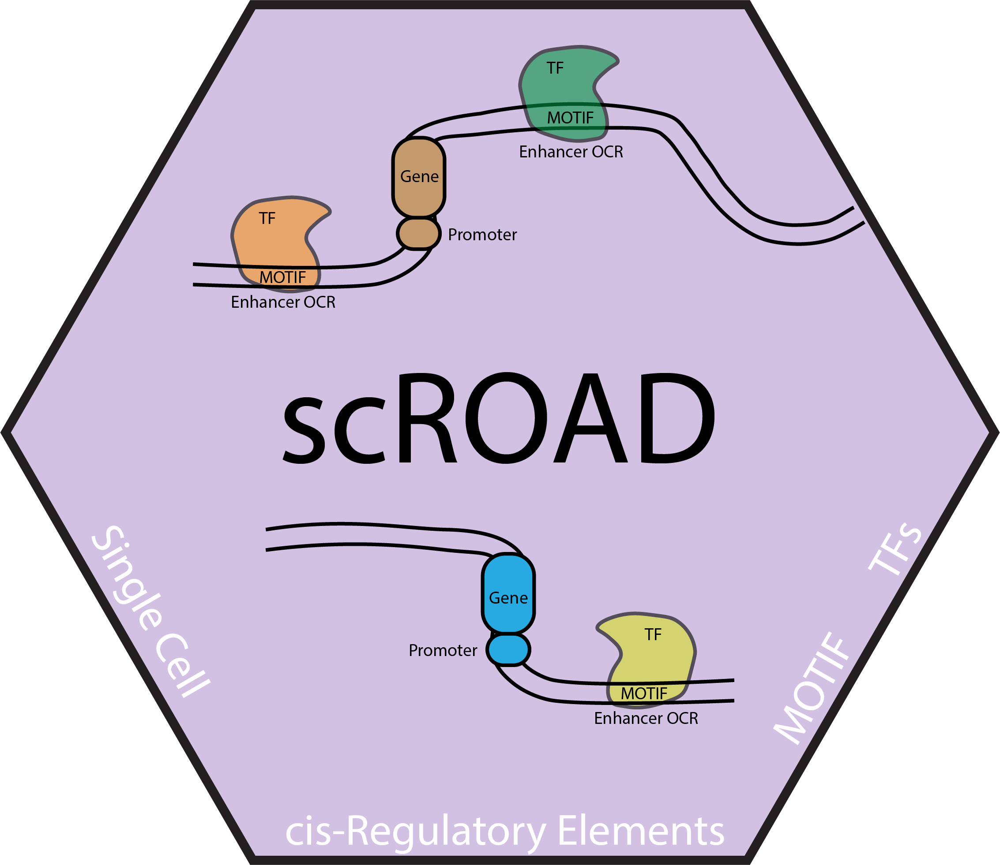

# scROAD: single-cell Regulatory Occupancy Analysis of Dynamics  

<!--  -->
<!--  -->

Introduction
------------

This the tutorial for running Cicero and TOBIAS packages on single cell ATAC data generated from cellranger.

The complete code has already been shared in the paper: scMultiomics_identifies_shared_and_distinct_pathways_in_Picks_and_Alzheimers_disease [GitHub](https://github.com/swaruplabUCI/scMultiomics_identifies_shared_and_distinct_pathways_in_PiDandAD). Here is a more organized tutorial, and shortly we will provide a wrapper package to summarize the in-between steps for user eaiser to handle the data between all those tools .

To support the paper, we have built a database for checking the prediction of TF binding difference between two dementia and their age-matched control; and a package for easy running multiple code before/during TOBIAS and integrating co-accessibility results from Cicero.

scROAD
------------

**scROAD** stands for:

1. **single-cell Regulatory Occupancy Analysis of Dynamics**:  
   This highlights the analytical framework and methodology used for studying transcription factor occupancy and regulatory changes in single-cell data.

2. **Single-cell Regulatory Occupancy Archive in Dementia**:  
   This emphasizes the curated database or archive for dementia-related research, housing single-cell regulatory data for further exploration.

These dual meanings reflect the comprehensive scope of scROAD, addressing both the analytical methods and the accessible resource for the scientific community.

How to cite
------------

Bentsen, M., Goymann, P., Schultheis, H. et al. ATAC-seq footprinting unravels kinetics of transcription factor binding during zygotic genome activation. Nat Commun 11, 4267 (2020). https://doi.org/10.1038/s41467-020-18035-1

Shi, Das & Morabito et al. Single-nucleus multi-omics identifies shared and distinct pathways in Pick’s and Alzheimer’s disease.

Contributors
------------

Zechuan Shi [@rootze](rootze.github.io) from Swarup lab at UCI

Samuel Morabito [@smorabit](https://smorabit.github.io/) from Swarup lab at UCI

Software, Algorithms, and Resources
------------

Zechuan Shi [@rootze](https://github.com/rootze) created analysis documents that combine code

**Programming software**:
- R v4.1.1 and above
- Python v3.6 and above

**Tools_Software**:
- Signac (v1.9.0)
- ArchRtoSignac (v1.0.4)
- Seurat (v4.4.0)
- Cicero ()
- TOBIAS (v0.14.0)

Getting help
------------
In case of any issues/questions/comments, please check out the [Issues](https://github.com/rootze/scROAD/issues). Otherwise, please write an issue for any questions [here](https://github.com/rootze/scROAD/issues).
